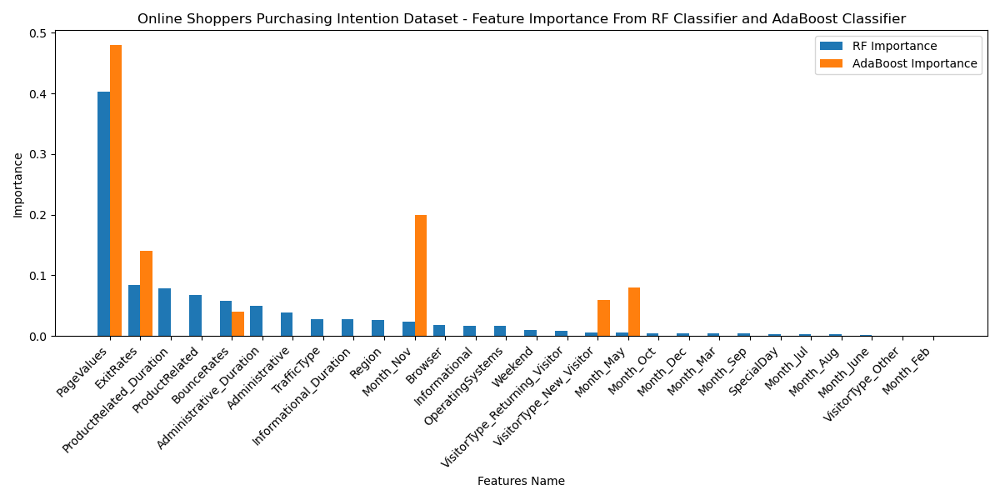
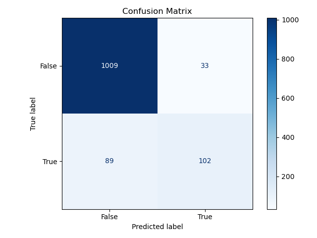

# Final Project Report: [Predicting Online Shopping Purchasing Intention Using Random Forest and AdaBoost Classifier ]

**Course**: CS383 - Introduction to Machine Learning  
**Semester**: Fall 2024  
**Team Members**: Amy Li, Cecilia Chen  
**Instructor**: Adam Poliak

---

## Table of Contents
1. [Abstract](#abstract)
2. [Introduction](#introduction)
3. [Problem Statement](#problem-statement)
4. [Related Work](#related-work)
5. [Data Description](#data-description)
6. [Methodology](#methodology)
7. [Results](#results)
8. [Discussion](#discussion)
9. [Conclusion and Future Work](#conclusion-and-future-work)
10. [References](#references)

---

## Abstract
Provide a brief summary of your project, including the problem tackled, the methodology used, and the key findings. This section should be concise and no more than 150-200 words.

---

## Introduction
Introduce the problem or question your project addresses. Explain its significance and relevance to machine learning. Include a brief overview of your approach and the objectives of the project.

Online shopping has become a dominant mode of consumer behavior, making it critical for online shopping platforms to understand the factors influencing purchasing decisions. Predicting whether a shopper will complete a purchase based on their browsing behavior can enable businesses to optimize their platforms designs and marketing strategies, leading to increased revenue and customer satisfaction.

This project explores the prediction of online shopping purchasing intentions using machine learning. By analyzing a dataset that captures customer browsing patterns, the project aims to identify key factors influencing purchase decisions and develop models that accurately predict purchase outcomes. Applying ensemble learning methods, Random Forest and AdaBoost, we aim to discover actionable insights while improving prediction accuracy.

---

## Problem Statement
Clearly define the problem you aimed to solve or the research question you sought to answer. Include any hypotheses you formulated and the scope of your project.

The central problem addressed in this project is:

**How can machine learning models predict online shopping purchasing intentions, and what are the key factors driving purchase decisions?**

The hypotheses for this study are as follows:
1. Features like time spent on product-related pages and the value of pages viewed are likely to have a strong influence on purchasing behavior.
2. Ensemble learning algorithms, such as Random Forest and AdaBoost, are expected to outperform simpler models because they can effectively capture complex interactions within the dataset.

This project focuses on the following tasks:
- Preparing and analyzing a dataset of online shopping sessions for better finding meaningful patterns.
- Conducting hyperparameter tuning to observe the influence of different hyperparameters at varying levels and optimize model performance.
- Developing and evaluating machine learning models (Random Forest and AdaBoost) with the best hyper parameter combination to predict purchasing intentions with high accuracy.
- Exploring the top features that drive purchasing decisions by analyzing feature importance scores generated by the models.

---

## Related Work
Summarize prior research or existing methods related to your project. Include citations or links to relevant papers, tools, or datasets. Discuss how your work builds upon or differs from these efforts.

---

## Data Description
Describe the dataset(s) you used, including:
- **Source(s)**: Where the data came from (e.g., Kaggle, UCI ML Repository, custom dataset).
- **Size and Format**: Number of rows, features, and data types.
- **Preprocessing**: Steps taken to clean or transform the data, including handling missing values or feature engineering.

---

## Methodology
Outline your approach, including:
1. The algorithms or models used (e.g., linear regression, neural networks, etc.).
2. Details of the training process (e.g., train-test splits, cross-validation).
3. Any hyperparameter tuning performed.
4. Tools and libraries employed (e.g., scikit-learn, PyTorch).

---

## Results
Present the results of your experiments, including:
- Key metrics (e.g., accuracy, precision, recall, F1 score, etc.).
- Comparisons between models or baselines.
- Visualizations (e.g., plots, confusion matrices).

### Hyperparameter tuning

Here we will include the results for hyperparameter tuning for both AdaBoost and Random Forest. We will use validation curve with both training accuracy and validation accuracy to show the sensitivity between changes in AdaBoost and Random Forest's accuracy with changes in hyperparameters of the model.

#### AdaBoost

**n_estimators**

The graph below shows the accuracy of the model on both the training and validation sets as the number of estimators increases. We varies n_estimators from 0 to 150. The training accuracy generally increases with more estimators at early stage, while the validation accuracy reaches a plateau and starts to fluctuate. This suggests that increasing the number of estimators beyond a certain point may lead to overfitting, as the model becomes too complex and starts to fit the noise in the training data. We suggests that setting n_estimators to be around 12 might be best. However, this might be influenced by the fact that we only use 1000 samples from the dataset.

.png)

**learning rate**

The plot shows the validation curve for an AdaBoost model as the learning rate increase from 0.1 to 1.

The blue line represents the training accuracy, while the dashed orange line represents the validation accuracy. As the learning rate increases, the training accuracy generally improves, but the validation accuracy initially increases, reaches a peak around a learning rate of 0.53, and then starts to decline.
This pattern suggests that a learning rate around 0.52 might be a good choice for this model. A higher learning rate can lead to overfitting, where the model becomes too sensitive to the training data and performs poorly on unseen data.

.png)

#### Random Forest
**n_estimators**

The plot illustrates the validation curve for a Random Forest model, showcasing the impact of the number of n_estimators on both training and validation accuracy. As the number of n_estimators increases, the training accuracy steadily improves, while the validation accuracy initially increases and then stabilizes around a value of 0.88. This suggests that increasing the number of estimators beyond a certain point (around 50) provides diminishing returns in terms of validation accuracy. Therefore, a model with approximately 45 estimators might be a good balance between model complexity and generalization performance.

.png)

**min_samples_split**

The plot displays the validation curve for a Random Forest model, focusing on the min_samples_split hyperparameter. As min_samples_split increases, the training accuracy decreases while the validation accuracy initially improves but then fluctuates. A min_samples_split value around 12 seems to offer a good balance between overfitting and underfitting, but further tuning might be necessary.

.png)

**max_depth**

The figure shows the validation curve of the random forest model, illustrating the effect of max_depth on the training and validation accuracy. As max_depth increases, the training accuracy steadily increases and peaks around 20. However, the validation accuracy initially rises, peaks around the same max_depth value, and then begins to decline. This suggests a potential overfitting problem, where the model becomes too complex and begins to memorize the training data instead of generalizing to unseen data. max_depth values around 20 seem to be a good compromise between bias and variance.

.png)

**criterion**

The plot illustrates the validation curve for a Random Forest model, comparing Gini impurity and Log Loss as splitting criteria. While Log Loss generally achieves higher training accuracy, Gini impurity often leads to better validation accuracy, suggesting a potential trade-off between model complexity and generalization.

.png)

### Model Comparision Based on Best Parameter Prediction

#### Feature Importance

| Feature                       |   RF Importance |   AdaBoost Importance |
|:------------------------------|----------------:|----------------------:|
| PageValues                    |     0.402614    |                  0.48 |
| ExitRates                     |     0.0846152   |                  0.14 |
| ProductRelated_Duration       |     0.0788203   |                  0    |
| ProductRelated                |     0.0672446   |                  0    |
| BounceRates                   |     0.0577837   |                  0.04 |
| Administrative_Duration       |     0.0503969   |                  0    |
| Administrative                |     0.0391559   |                  0    |
| TrafficType                   |     0.0283468   |                  0    |
| Informational_Duration        |     0.0280264   |                  0    |
| Region                        |     0.0270764   |                  0    |
| Month_Nov                     |     0.0235772   |                  0.2  |
| Browser                       |     0.0175859   |                  0    |
| Informational                 |     0.0170328   |                  0    |
| OperatingSystems              |     0.0166456   |                  0    |
| Weekend                       |     0.00945192  |                  0    |
| VisitorType_Returning_Visitor |     0.00852322  |                  0    |
| VisitorType_New_Visitor       |     0.00635391  |                  0.06 |
| Month_May                     |     0.0063041   |                  0.08 |
| Month_Oct                     |     0.00500593  |                  0    |
| Month_Dec                     |     0.00498314  |                  0    |
| Month_Mar                     |     0.00471067  |                  0    |
| Month_Sep                     |     0.00387399  |                  0    |
| SpecialDay                    |     0.00348955  |                  0    |
| Month_Jul                     |     0.00327302  |                  0    |
| Month_Aug                     |     0.00261917  |                  0    |
| Month_June                    |     0.00183814  |                  0    |
| VisitorType_Other             |     0.000426073 |                  0    |
| Month_Feb                     |     0.000225018 |                  0    |

The feature importance comparison for Random Forest and AdaBoost is shown in a side-by-side bar chart:

The feature importance scores derived from Random Forest and AdaBoost are shown in the chart below. PageValues is the most influential feature for both models, with Random Forest assigning an importance of 40.26% and AdaBoost assigning 48%. Other key features include ExitRates and ProductRelated_Duration, which play significant roles in Random Forest. For AdaBoost, Month_Nov and ExitRates are more emphasized. To make a hyposthesis, Black-Friday could be related with this high importance of November.

#### Model Performance
A comparison of the performance metrics for Random Forest and AdaBoost is shown below:

| Model         |   Accuracy |   Precision |   Recall |   F1 Score |
|:--------------|-----------:|------------:|---------:|-----------:|
| Random Forest |   0.901054 |    0.755556 | 0.534031 |   0.625767 |
| AdaBoost      |   0.898621 |    0.726027 | 0.554974 |   0.62908  |

Both models have similar accuracy, with Random Forest slightly outperforming AdaBoost in precision, while AdaBoost performed better in recall and F1 Score. This indicates that AdaBoost may be better at identifying actual purchasers due to its emphasis on learning from misclassified instances during training, whereas Random Forest focuses on overall accuracy and precision. Despite these differences, both models demonstrate comparable performance overall.

#### Confusion Matrix
The performance of the best-performing model, Random Forest, is summarized in a confusion matrix:

The performance of the two models is summarized in their confusion matrices. For Random Forest, the model correctly identified 1009 instances where a purchase did not occur (True Negatives) and 102 instances where a purchase occurred (True Positives). However, there were 89 False Negatives, where actual purchases were missed, and 33 False Positives, where purchases were incorrectly predicted. These results indicate that while the model performs well in identifying non-purchases, it struggles with predicting purchase outcomes.

---

## Discussion
Interpret your results:

- What worked well?
- What challenges or limitations did you encounter?
- How do the results address your problem statement?

### What Worked Well
- The ensemble learning models, Random Forest and AdaBoost, proved effective in predicting online shopping purchasing intentions. Both models demonstrated strong performance, with accuracies of approximately 90%. Random Forest excelled in precision, indicating its ability to minimize false positive predictions, while AdaBoost performed slightly better in recall and F1 Score, suggesting its strength in identifying actual purchasers. 
- The feature importance analysis provided clear insights, highlighting PageValues, ExitRates, and ProductRelated_Duration as the most significant predictors of purchasing behavior.

### Challenges and Limitations
Despite the overall success of the models, several challenges were encountered:
1. **Class Imbalance**: The dataset contained more non-purchase cases than purchase cases, which affected the models' ability to predict true positives effectively.
2. **Hyperparameter Tuning Complexity**: Observing the effects of different hyperparameter levels required extensive experimentation, which was computationally intensive and time-consuming.
3. **Model Bias**: Random Forest tended to focus more on precision at the cost of recall, while AdaBoost's boosting mechanism sometimes led to overfitting to misclassified instances.

### Addressing the Problem Statement
The results successfully address the problem statement by:
- Identifying the top three features influencing purchasing behavior: PageValues, ExitRates, and ProductRelated_Duration. These findings support the idea that certain browsing behaviors, like spending more time on specific pages or viewing high-value pages, are closely linked to whether a shopper makes a purchase.

- Demonstrating that ensemble models like Random Forest and AdaBoost are well-suited for classification problems, as they effectively handle complex interactions within the dataset.

---

## Conclusion and Future Work

Summarize the key findings and discuss potential extensions of your work. What would you do differently with more time or resources?

### Future Work
To further enhance the findings:
- Addressing class imbalance through techniques such as oversampling, undersampling, or synthetic data generation could improve recall.
- Exploring additional ensemble methods or deep learning models might uncover new patterns and improve predictive accuracy.
- Incorporating temporal or behavioral data could provide deeper insights into shopper behavior, especially for time-sensitive or recurring purchasing patterns.

---

## References

Include any citations for datasets, tools, libraries, or papers used in your project. Use a consistent citation format.
